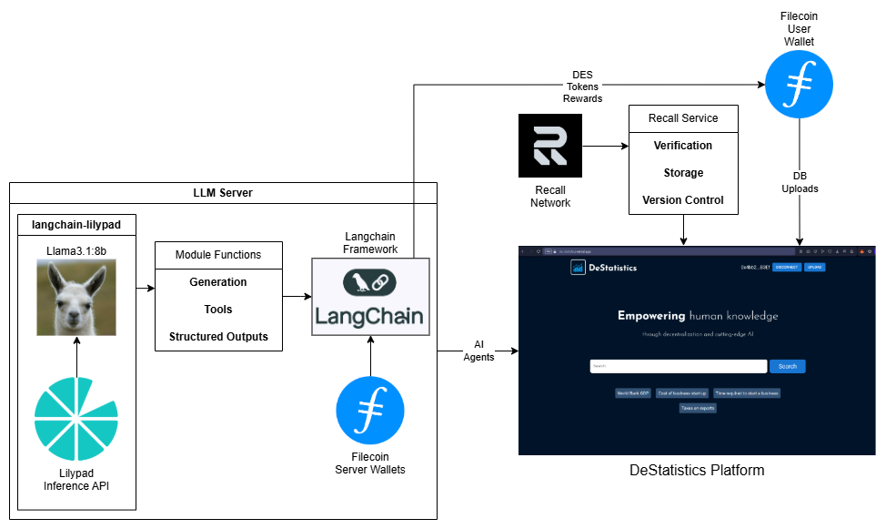
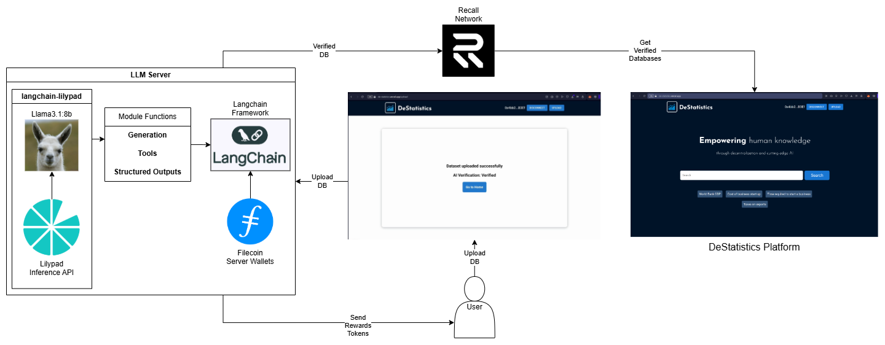
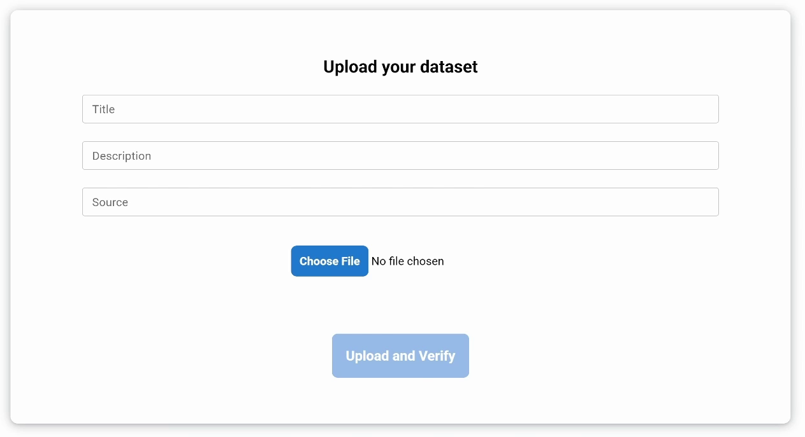
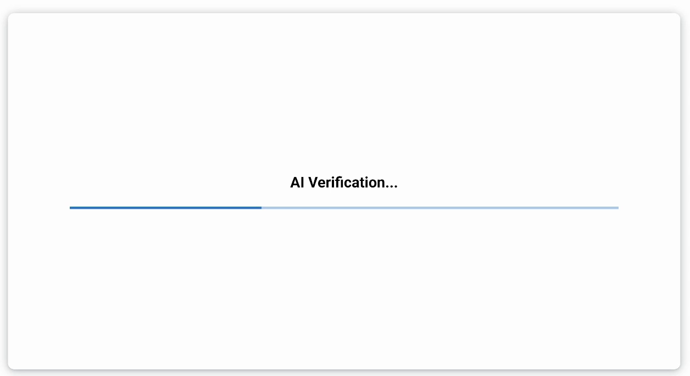
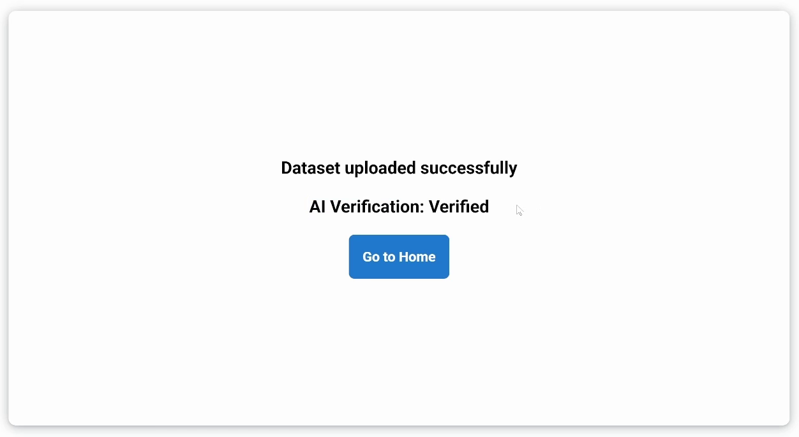
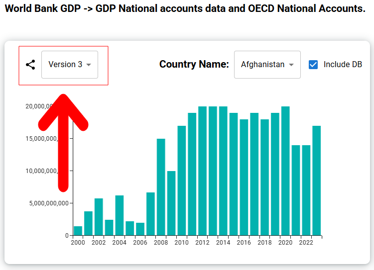
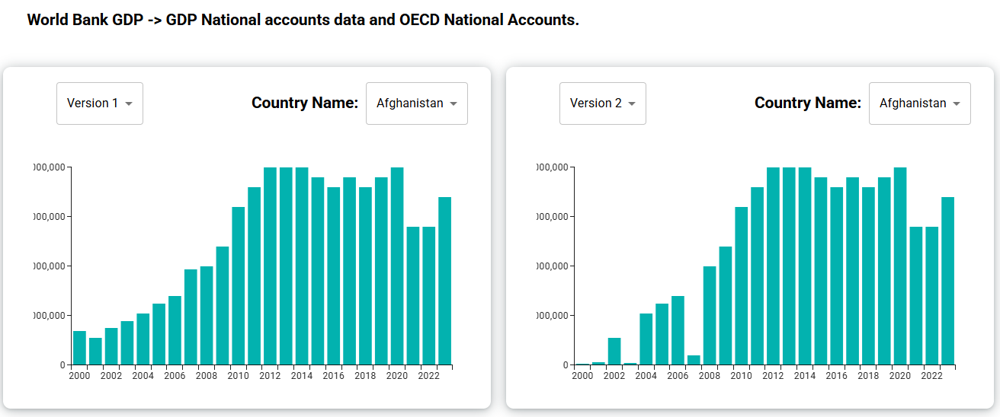
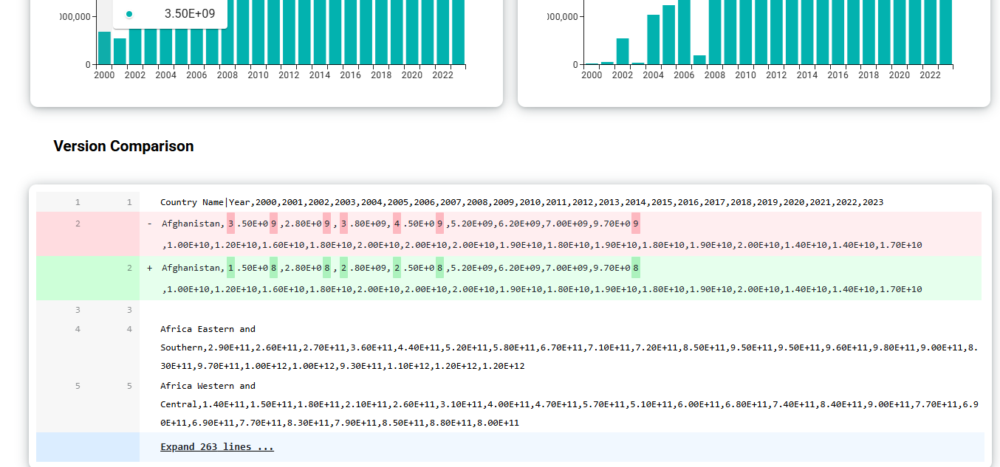
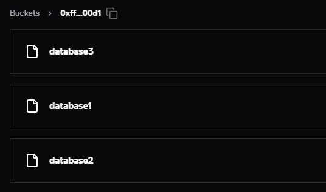
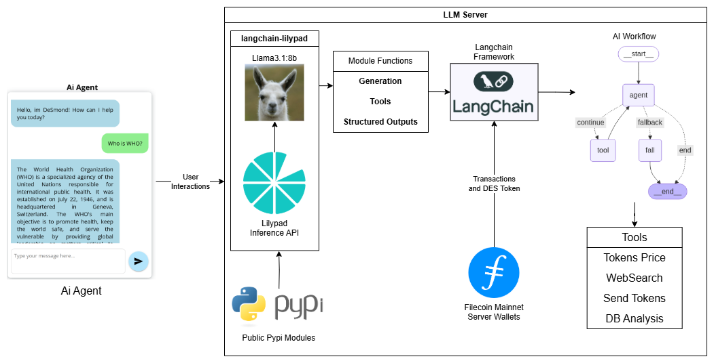

# DeStatistics-FIL


DeStatistics is a Web3 platform where AI Agents verify public data, ensure transparency, and reward contributors.

# Fast Links:

### Check it out! it is live and on Filecoin Mainnet!:
- [**Web Page**](https://de-statistics.vercel.app)
- [**Demo Video**](https://youtu.be/UMMkbywKAuI)

**If you're a judge and want to go directly to any category, here are some important links:**

- [**Filecoin**](#filecoin)
- [**Recall**](#recall)
- [**Lilypad**](#lilypad)

## System Diagram:




- Filecoin: We used the EVM to make donations to database uploaders and distribute rewards of our DES ERC20 token based on the AI ​​DB verification results. It is the base of all our storage and main blockchain to do everything.

- Recall: We used this blockchain to provide a secure and decentralized source of storage for AI Agents in the databases and their verification and version control creating an auditable trail.

- LangChain with Lilypad: This framework was primarily used to generate AI Agent workflows and their interactions with the blockchain and users. This through our custom Agent module full langchain compatible developed to empower the capabilities of the Lilypad API. 


# Filecoin:

Within the entire concept of our platform, we have two functionalities that best represent the power of AI Agents with their interactions with the blockchain and decentralized data storage.

### Ai Agent Main Chat Tools:

The chat within the platform is intended to provide the user with an assistant to resolve general queries or more complex tasks.

AI Agent Tools on LangChain Framework with [Lilypad Custom Module](#lilypad):

- Send Tokens: The AI Agent can transfer our token to any user who uploads a database and the AI ​​validates it for addition to our site. This reward is subject to the following tool.

    ```python
    url = "http://localhost:8001/transaction"
    payload = json.dumps({
    "to": address,
    "value": amount
    })
    headers = {
    'Content-Type': 'application/json'
    }
    response = requests.request("POST", url, headers=headers, data=payload)
    print("Token transfer hash: "+response.text)
    ```

  - DES Token Contract: 
    - https://filfox.info/en/address/0xA8843d8d35BDE678c5224Ec7e2132Cf68ac27c54
  - DES Token Contract Code:
    - [Contract Code](./contracts/DeSToken.sol)
  - Transfer Token Code:
    - [Transfer Token Code](./token-transfer-server/server.js)

- DB Analysis: The AI Agent can perform a complete analysis of a database by cross-checking it with the tools we'll discuss later and issue a verdict as to whether it's a valuable database or not. This verified data is then uploaded to the Recall network so it can be consumed by the website. [Example DB](./example-db/Taxes%20on%20exports.csv)

    ```python
    class ResponseFormatter(BaseModel):
    "Evaluate the dataset based on its quality, accuracy, completeness, consistency, and relevance to the intended real-world application. Determine if it is valid and reliable for use. """
    answer: bool = Field(description="Return True if the dataset meets all criteria and is deemed valid, or False if it does not.")
    ```

### AI Extra Tools:

- Tokens Price: Using the Coingecko API, the agent can access real-time prices for the top tokens on the market.

    ```python
    """Fetch real-time prices of cryptocurrency tokens from the top 25 in the market."""
    temp_counter = counter
    flag = False
    if temp_counter > 25:
        temp_counter = 25
        flag = True
    elif temp_counter < 1:
        temp_counter = 1
        flag = True
    url = f"https://api.coingecko.com/api/v3/coins/markets?vs_currency=usd&per_page={temp_counter}"
    headers = {'accept': 'application/json'}
    response = requests.request("GET", url, headers=headers, data={})
    return response.text + (" This information reflects correctly the current market price and is up-to-date. "
                            if not flag else f"The query was adjusted from {counter} to {temp_counter} to ensure proper functionality.")
    ```

- WebSearch: With this module, the agent can search for information on the Internet and thus provide the user with real-time information.

    ```python
    """This tool allows users to perform accurate and targeted internet searches for specific terms or phrases."""
    res = search.invoke(webprompt)
    return res
    ```
---
**The full code for the AI Agent and Token service is in the following links:**

- [AI Agent Code](./lilypad-server/main.py)
- [Token Transfer Code](./token-transfer-server/server.js)

# Recall:

Having a secure, fast, and, above all, accessible storage source for our platform and agents was vital to the implementation of a system like ours.

## Upload Database:



- The user uploads their database and fills in the information required by the platform. We provide you with an [Example DB](./example-db/Taxes%20on%20exports.csv) ready to be uploaded to the Platform.



- Once you've completed the form, simply press the Upload and Verify button. This will begin the automatic review process.



- As shown in the diagram, the verification process is automatic and the user only has to wait for their result to arrive and, if it is satisfactory, their rewards.



---

**All interactions with Recall at the code level are in the following links.**

- [Get DB](./de-statistics/src/actions/recallServer.js)
- [Upload DB](./de-statistics/src/actions/recallServer.js)

## Version Control:

- Databases can be updated, so you can switch between database versions if they are available.



- If you click the button on the left, you can visually compare versions so you can review the differences between the data. This also provides a way to audit changes between datasets.



- And finally, at the bottom, we can see the raw data that has been modified completely. This allows us to audit the data from the source file.



- Finally, the file organization performed at the Recall level involves uploading multiple databases to the same bucket, but using the latest version number.



- And in the general repository where we store file references and versions. These are saved as follows.

    ```json
    {
        "key": "gdp",
        "uploader": "0x4bb24Db28959248E00792aDAF04a8EB32C5AB3Ef",
        "source": "World Bank",
        "release": 1738044000,
        "updated": 1743990630,
        "title": "World Bank GDP",
        "description": "GDP National accounts data and OECD National Accounts.",
        "bucket": "0xff000000000000000000000000000000000000d1",
        "verified": true,
        "version": 3
    }
    ```

---
**All version control with Recall at the code level are in the following links.**
- [Get DB](./de-statistics/src/actions/recallServer.js)
- [Version Comparison](./de-statistics/src/app/versions/[db]/page.js)

# Lilypad:

We developed ChatLilypad, a powerful and highly customizable chat module built on the LangChain framework. It integrates seamlessly with the Lilypad API, enhancing traditional chat models with advanced capabilities such as tool binding, structured outputs, and workflow integration. ChatLilypad enables developers to build dynamic, intelligent conversational agents tailored to their specific use cases.



## Overview

ChatLilypad is designed to facilitate intelligent, scalable conversations by combining a Langchain workflows with external tools via the Lilypad API. 

**It's Public and Ready to Use!:**
- pypi lilypad module: https://pypi.org/project/langchain-lilypad/

The model supports structured responses, tool binding, and graph and workflow integration while providing high configurability for advanced use cases.

## Features

- **Lilypad Chat Model**: Dynamically generates responses using the Lilypad API.
- **Tool Integration**: Connects external tools to expand conversational capabilities.
- **High Configurability**: Allows developers to modify parameters like temperature, API endpoints, and tool configurations.
- **Structured Output**: Delivers organized, schema-defined responses for improved validation.
- **Error Handling**: Incorporates fallback mechanisms for API connectivity and parsing issues.
- **Extendable Design**: Built on `LangChain`, enabling modular development and scalability.

## Setup

### Prerequisites
To use ChatLilypad, ensure you have:
- Python 3.8 or higher
- Pip (Python package manager)
- API key for the [Lilypad API](https://anura.lilypad.tech)

### Dependencies
Required Python packages:
- `requests`: For HTTP API communication.
- `json`: For data serialization and deserialization.
- `pydantic`: For data validation and model schema definitions.
- `langchain_core`: Core classes and functionality for chat models.

Install all dependencies:
```bash
pip install requests pydantic langchain-core
```

### Installation
To install the ChatLilypad module:
```bash
pip install langchain-lilypad
```

## Usage

### Initializing the Model
Import and initialize `ChatLilypad` with your Lilypad API key and the model name:
```python
from langchain_lilypad import ChatLilypad

lilypad_model = ChatLilypad(
    model_name="your_model_name",
    api_key="your_api_key"
)
```

### Generating Responses
Send a list of messages to the model to generate intelligent responses:
```python
from langchain_core.messages import BaseMessage

messages = [
    BaseMessage(type="human", content="Tell me a joke!"),
]

response = lilypad_model.invoke(messages)
print({"messages": [response]})
```

## Customization

### Adjusting Temperature
Control the randomness of responses by modifying the `temperature` parameter:
```python
lilypad_model.temperature = 0.8
```

### Changing the API Endpoint
Connect to a custom API endpoint by updating the `api_url`:
```python
lilypad_model.api_url = "https://new-api-endpoint.com"
```

## Tool Integration

Tooling enhances ChatLilypad's capabilities by enabling seamless integration with external APIs and resources.

### Supported Models
Currently, only the following models support tooling and Structured Output:
- **llama3.1:8b**
- **qwen2.5:7b**
- **qwen2.5-coder:7b**
- **phi4-mini:3.8b**
- **mistral:7b**

### Defining and Binding Tools
Tools can be defined and dynamically bound to the model. For example:
```python
from langchain_community.tools import DuckDuckGoSearchResults
from langchain_core.tools import tool

search = DuckDuckGoSearchResults(safesearch="strict", max_results=10)

@tool
def websearch(webprompt: str) -> str:
    """Performs accurate web searches based on user input."""
    return search.invoke(webprompt)

lilypad_model = lilypad_model.bind_tools([websearch])
```

Once bound, tools enable enhanced interaction during conversations.

## Structured Output

ChatLilypad supports structured output for organized and schema-compliant responses.

### Defining Structured Output
Define structured schemas using `Pydantic` models:

```python
from pydantic import BaseModel, Field
from typing import Optional

class Joke(BaseModel):
    """Joke to tell user."""
    setup: str = Field(description="The setup of the joke")
    punchline: str = Field(description="The punchline of the joke")
    rating: Optional[int] = Field(default=None, description="How funny the joke is (1-10)")
```

### Example Usage
Bind the structured schema to the model:
```python
structured_llm = lilypad_model.with_structured_output(Joke)
response = structured_llm.invoke("Tell me a joke")
print(response)
```
This ensures that generated responses conform to the `Joke` schema, improving validation and usability.

---

**All Langchain interactions and Lilypad API at the code level are in the following links.**

- [Module Code](./lilypad-langchain-module/module.py)
- [AI Agent Code](./lilypad-server/main.py)
