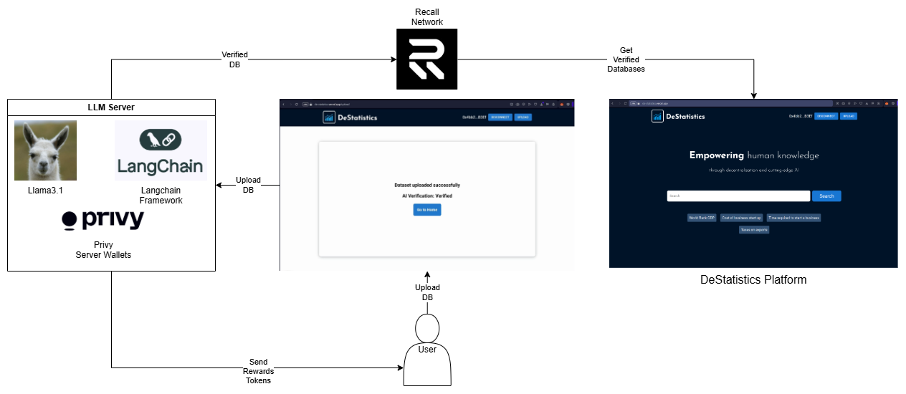

# DeStatistics-FIL

DeStatistics is a Web3 platform where AI Agents verify public data, ensure transparency, and reward contributors.

# Fast Links:

### Check it out! it is live and on Base Mainnet!:
- [**Web Page**](https://de-statistics.vercel.app)

- [**Demo Video**](https://youtu.be/gs6MxuGJd8g)

**If you're a judge and want to go directly to any category, here are some important links:**

- [**Filecoin**](#filecoin)
- [**Recall**](#recall)

## System Diagram:

- Recall: We used this blockchain to provide a secure and decentralized source of storage for AI Agents in the databases and for their verification.
- LangChain: This framework was primarily used to generate AI Agent workflows and their interactions with the blockchain and users.

# Filecoin:

Within the entire concept of our platform, we have two functionalities that best represent the power of AI Agents with their interactions with the blockchain and decentralized data storage.

## Ai Agent Chat:

The chat within the platform is intended to provide the user with an assistant to resolve general queries or more complex tasks.

AI Agent Tools on LangChain Framework:

- Send Tokens: The AI Agent can transfer our token to any user who uploads a database and the AI ​​validates it for addition to our site. This reward is subject to the following tool.

        url = "http://localhost:8001/transaction"
        payload = json.dumps({
        "to": address,
        "value": amount
        })
        headers = {
        'Content-Type': 'application/json'
        }
        response = requests.request("POST", url, headers=headers, data=payload)
        print("Token transfer hash: "+response.text)

- DB Analysis: The AI Agent can perform a complete analysis of a database by cross-checking it with the tools we'll discuss later and issue a verdict as to whether it's a valuable database or not. This verified data is then uploaded to the Recall network so it can be consumed by the website. [Example DB](./example-db/Taxes%20on%20exports.csv)

        class ResponseFormatter(BaseModel):
        "Evaluate the dataset based on its quality, accuracy, completeness, consistency, and relevance to the intended real-world application. Determine if it is valid and reliable for use. """
        answer: bool = Field(description="Return True if the dataset meets all criteria and is deemed valid, or False if it does not.")

- Tokens Price: Using the Coingecko API, the agent can access real-time prices for the top tokens on the market.

        """Fetch real-time prices of cryptocurrency tokens from the top 25 in the market."""
        temp_counter = counter
        flag = False
        if temp_counter > 25:
            temp_counter = 25
            flag = True
        elif temp_counter < 1:
            temp_counter = 1
            flag = True
        url = f"https://api.coingecko.com/api/v3/coins/markets?vs_currency=usd&per_page={temp_counter}"
        headers = {'accept': 'application/json'}
        response = requests.request("GET", url, headers=headers, data={})
        return response.text + (" This information reflects correctly the current market price and is up-to-date. "
                                if not flag else f"The query was adjusted from {counter} to {temp_counter} to ensure proper functionality.")
- WebSearch: With this module, the agent can search for information on the Internet and thus provide the user with real-time information.

        """This tool allows users to perform accurate and targeted internet searches for specific terms or phrases."""
        res = search.invoke(webprompt)
        return res

The full code for the AI Agent is in the following link:

[CODE](./ollama-server/main.py)

# Recall:

Having a secure, fast, and, above all, accessible storage source for our platform and agents was vital to the implementation of a system like ours.

- The user uploads their database and fills in the information required by the platform. We provide you with an [Example DB](./example-db/Taxes%20on%20exports.csv) ready to be uploaded to the Platform.

- Once you've completed the form, simply press the Upload and Verify button. This will begin the automatic review process.

- As shown in the diagram, the verification process is automatic and the user only has to wait for their result to arrive and, if it is satisfactory, their rewards.

All interactions with Recall at the code level are in the following links.

- [Get DB](./de-statistics/src/actions/fetchDataset.js)
- [Upload DB](./de-statistics/src/actions/uploadFile.js)
- [Update Main DB](./de-statistics/src/actions/updateMainDB.js)